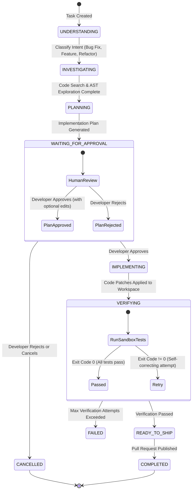
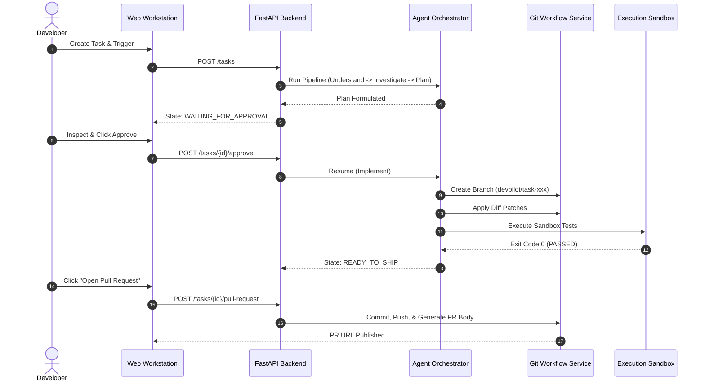

# Pasha DevPilot — System Architecture & Engineering Specifications

This document outlines the architectural blueprints, subsystem designs, state transition models, and security guarantees of **Pasha DevPilot**.

---

## 1. High-Level Subsystem Overview

```
                                    +----------------------------------+
                                    |    Next.js 15 Web Workstation    |
                                    |  (Tailwind, Monaco, SSE Client)  |
                                    +-----------------+----------------+
                                                      |  HTTP / SSE
                                                      v
                                    +----------------------------------+
                                    |       FastAPI Application        |
                                    |      (Routes, Auth, Models)      |
                                    +--------+--------+--------+-------+
                                             |        |        |
                         +-------------------+        |        +-------------------+
                         v                            v                            v
       +---------------------------------+  +--------------------+  +---------------------------------+
       |      Indexer & Search Engine    |  |    Async DB Store  |  |       Agent Orchestrator        |
       |  - Python / JS / TS AST Parser  |  |  (SQLAlchemy Async)|  |  - 7-Stage State Machine        |
       |  - Exact / Symbol / Semantic    |  +--------------------+  |  - Tool Permission Registry     |
       +---------------------------------+                          |  - Provider Abstraction         |
                         |                                          +----------------+----------------+
                         v                                                           |
       +---------------------------------+                                           v
       |      Token Context Engine       |                          +---------------------------------+
       |  - Token budgeting & prioritization                        |    Restricted Execution Sandbox |
       |  - Dynamic snippet injection    |                          |  - Safe command allowlist       |
       +---------------------------------+                          |  - Path containment & timeout   |
                                                                    +----------------+----------------+
                                                                                     |
                                                                                     v
                                                                    +---------------------------------+
                                                                    |       Git Workflow Engine       |
                                                                    |  - Isolated branch checkout     |
                                                                    |  - Unified diff generation      |
                                                                    |  - Pull request formatting      |
                                                                    +---------------------------------+
```

---

## 2. Autonomous Agent State Machine

Every engineering task processed by DevPilot progresses through a deterministic, strictly validated 7-stage state machine:



### State Definitions & Invariants:
1. **`UNDERSTANDING`**:
   - Classifies task intent: `BUG_FIX`, `FEATURE`, `REFACTOR`, `DOCUMENTATION`, `SECURITY_AUDIT`.
   - Extracts relevant constraints, acceptance criteria, and repo targets.
2. **`INVESTIGATING`**:
   - Invokes Code Search tools (exact string match, symbol AST lookups, semantic ranker).
   - Identifies candidate files and dependent definitions.
3. **`PLANNING`**:
   - Generates a markdown plan detailing root cause analysis, target file paths, proposed unified diffs, and verification commands.
4. **`WAITING_FOR_APPROVAL` (Human-in-the-Loop Gate)**:
   - **Critical Safety Guard**: The agent stops execution. No files are modified.
   - The developer can review the plan in the workstation, edit instructions, approve, or reject.
5. **`IMPLEMENTING`**:
   - Generates precise unified diffs and applies patches with transaction-like rollback safety.
6. **`VERIFYING`**:
   - Invokes the `ExecutionSandbox` to run targeted test suites (`pytest`, `npm test`).
   - If tests fail, the orchestrator triggers an automatic self-correction attempt using captured traceback output.
7. **`READY_TO_SHIP`**:
   - Test evidence is recorded. A clean branch (`devpilot/task-...`) is prepared for GitHub PR creation.

---

## 3. Codebase Indexer & Context Engine

### AST Symbol Parsing
The repository indexer (`RepositoryIndexer`) inspects the target repository without loading entire files into memory:
- **Python**: Uses the native `ast` module to extract classes, class methods, top-level functions, imports, and docstrings.
- **JavaScript / TypeScript**: Employs regex and structural parsers to identify exported components, functions, interfaces, and classes.
- **Sensitive File Shield**: Ignores `.env`, `.pem`, `.key`, `id_rsa`, `.git`, `node_modules`, `venv`, `__pycache__`.

### Context Engine Prioritization
When an agent prepares to generate code, passing an entire 100,000-line codebase exceeds model context limits and degrades attention:
1. **Tier 1 (High Priority)**: Directly targeted files and symbols identified during investigation.
2. **Tier 2 (Medium Priority)**: Type signatures, class definitions, and imported utilities from adjacent modules.
3. **Tier 3 (Context Memory)**: Persistent architectural rules saved in `ProjectMemory` (e.g., *"All endpoints must return Pydantic models"*).
4. **Budgeting**: Token counter trims lowest-priority context to ensure the prompt fits comfortably within the AI provider's context budget.

---

## 4. Execution Sandbox & Security Architecture

DevPilot runs developer commands in an isolated execution sandbox (`ExecutionSandbox`) designed with defense-in-depth principles:

### Allowlisted Executables
| Language / Tool | Permitted Command Patterns |
| :--- | :--- |
| **Python** | `pytest`, `python -m pytest`, `python -m unittest`, `ruff`, `flake8` |
| **Node.js** | `npm test`, `npx jest`, `npx vitest`, `npm run lint` |
| **Go** | `go test ./...` |
| **Rust** | `cargo test` |

### Blocked Operations
- **Privilege Escalation**: `sudo`, `su`, `chmod +x`
- **Filesystem Destruction**: `rm -rf`, `del /f /s /q`, `format`
- **Network / Shell Spawning**: `curl ... | bash`, `nc -e`, `powershell -enc`, `bash -i`
- **Timeout Enforcement**: All commands enforce a strict timeout (default: 30 seconds) to prevent infinite loops.

---

## 5. Git Workflow & Pull Request Engine



### PR Body Structure
The generated pull request body automatically includes:
- **Summary of Changes**: High-level explanation of problem and fix.
- **Affected Files**: Table of modified paths with lines added/deleted.
- **Verification Evidence**: Full terminal log showing test command, execution time, and passed assertion counts.
- **Developer Review Checklist**: Actionable review checklist for peer developers.

---

## 6. Real-Time Event Bus (SSE)

Real-time telemetry flows from the backend to the frontend using Server-Sent Events (`EventBus`):
- Endpoint: `GET /tasks/{task_id}/events`
- Event Types:
  - `state_change`: Pipeline state transition (e.g. `INVESTIGATING` -> `PLANNING`).
  - `agent_log`: Diagnostic trace message from the agent.
  - `tool_invocation`: Notification of tool execution (`search_symbols`, `write_diff`).
  - `verification_result`: Test runner output and duration.
  - `plan_ready`: Plan markdown ready for human approval.
  - `ready_to_ship`: Pull request ready to be opened.
