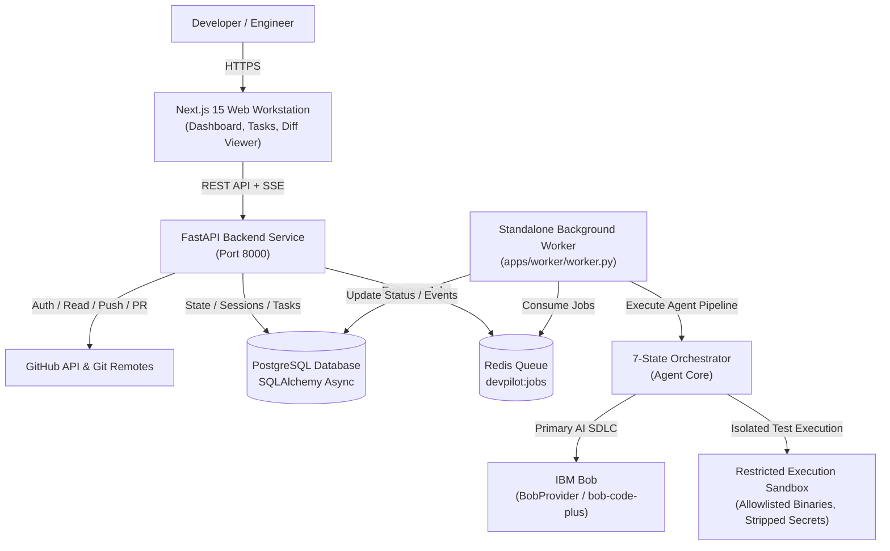

# Pasha DevPilot 🚀

> **Your AI Software Engineer.**  
> *Understand. Plan. Build. Verify. Ship.*

[](LICENSE)
[](https://bob.ibm.com)
[](https://nextjs.org)
[](https://fastapi.tiangolo.com)
[](https://railway.app)

---

## 1. Overview

**Pasha DevPilot** is a production-grade autonomous software engineering platform designed to eliminate the toil of bug remediation, code patching, test verification, and pull request generation.

Unlike chatbot assistants that blindly dump code blocks into chat or hallucinate repository structure, Pasha DevPilot connects directly to your real GitHub repositories, extracts AST-level repository topology, forms structured implementation plans, requests human approval before writing a single line of code, executes tests inside a restricted execution sandbox, and autonomously opens truthful GitHub Pull Requests.

Built as an extension to **IBM Bob** for the **IBM Bob 2.0 Hackathon**, DevPilot features a first-class runtime integration via [`BobProvider`](packages/agent_core/providers/bob_provider.py) and was architected and verified using the IBM Bob development environment.

---

## 2. Why DevPilot?

| Traditional AI Coding Tools | Pasha DevPilot |
|---|---|
| Chat-only interfaces with copy-pasting code snippets | Full-stack platform connected directly to GitHub repositories |
| Blindly overwrites files with unvetted hallucinations | **Human-in-the-Loop approval gate** before any write operations |
| Fake test outputs or unexecuted code claims | Real isolated sandbox running `pytest`, `npm test`, `jest`, etc. |
| Insecure token management (asking users to paste PATs) | Server-side GitHub OAuth 2.0 with HMAC-SHA256 CSRF protection |
| Unbounded retries or infinite loops on test errors | **Bounded self-healing loop** (maximum 3 attempts) |
| Hardcoded demo mocks masquerading as real integrations | **Zero mock data in production**: real Git commits, real branch pushes, real PRs |

---

## 3. Architecture

Pasha DevPilot is organized as a decoupled multi-service production architecture on **Railway**:



### Production Service Topology (Railway)
- **`web`**: Next.js 15 App Router workstation (SSR & React Server Components).
- **`api`**: FastAPI high-throughput REST API with SSE event streaming.
- **`worker`**: Python background daemon consuming long-running AI and Git tasks.
- **`postgres`**: Relational database for users, sessions, repositories, tasks, steps, diffs, and verification runs.
- **`redis`**: High-performance job queue and realtime event coordination.

---

## 4. Key Features

- **Real GitHub OAuth & Zero PAT Exposure**: Clean authorization flow; client secrets and access tokens remain strictly server-side.
- **Dynamic Repository Discovery**: Live inspection of public and private user repositories without pre-indexing or context stuffing.
- **Sensitive File Shield**: Automatic exclusion of `.env*`, `*.pem`, `*.key`, and secret patterns from model context.
- **AST Repository Intelligence**: Extracts class and function symbol trees to pinpoint defect locations with evidence.
- **Human-in-the-Loop Safety Gate**: The agent enters `WAITING_FOR_APPROVAL` after planning and cannot modify files until you approve.
- **Monaco Diff Viewer**: Side-by-side and inline syntax-highlighted diffs displaying additions, deletions, and file hashes.
- **Restricted Execution Sandbox**: Safe execution of test commands with directory traversal containment and secret stripping.
- **Bounded Self-Healing**: Diagnoses traceback errors and iterates up to 3 repair cycles before reporting truth.
- **Real Branch Push & Truthful PRs**: Creates `devpilot/<task-slug>-<task-id>`, commits targeted files, pushes to `origin`, and opens real GitHub PRs with verification logs.
- **Audit Logging**: Immutable event ledger tracking every login, plan approval, file change, verification run, and PR.

---

## 5. End-to-End Workflow

```text
1. UNDERSTAND ➔ Inspects repository file tree, package manifests, and AST symbols.
2. PLAN       ➔ Formulates an evidence-backed implementation plan and impact assessment.
3. APPROVE    ➔ Human reviews plan in the approval modal and clicks "Approve & Implement".
4. BUILD      ➔ Generates unified diffs and applies surgical file patches in isolated workspace.
5. VERIFY     ➔ Executes test runner in the sandbox; analyzes test tracebacks if failed (max 3 retries).
6. SHIP       ➔ Creates Git branch, commits changes, pushes to remote origin, and opens a real GitHub PR.
```

---

## 6. GitHub Integration

Pasha DevPilot features real GitHub integration:
1. **OAuth 2.0 Flow**: Users initiate authorization via `GET /auth/github`, securely completing OAuth callback with HMAC-SHA256 CSRF verification.
2. **Repository Discovery**: Direct queries to GitHub API for accessible public, private, and organization repositories.
3. **Targeted Cloning**: Clones or mounts only the explicitly selected repository.
4. **Git Remote Push**: Uses dynamic server-side token authentication for pushing branches without storing credentials in the workspace.
5. **Real Pull Requests**: Issues authenticated GitHub REST API calls to open Pull Requests with automated summaries and test logs.
6. **Clean Disconnect**: `POST /auth/github/disconnect` purges tokens and revokes active sessions immediately.

---

## 7. AI Agent & Provider Routing

Pasha DevPilot utilizes a unified [`ModelRouter`](packages/agent_core/providers/router.py) that prioritizes IBM Bob:

```text
BOB_API_KEY set? ───────► BobProvider (IBM Bob — bob-code-plus) [PRIMARY]
                          │
DEEPSEEK_API_KEY set? ──► DeepSeekProvider (CleanAPIs — deepseek-v4-flash) [FALLBACK]
                          │
GROQ_API_KEY set? ──────► GroqProvider (llama-3.3-70b-versatile) [VERIFICATION]
```

### The 7-State Orchestrator Machine
1. `UNDERSTANDING`: Repository topology mapping & symbol indexing.
2. `INVESTIGATING`: Comprehensive diagnostic analysis & finding synthesis.
3. `PLANNING`: Detailed plan generation with risk analysis.
4. `WAITING_FOR_APPROVAL`: **Human gate** requiring explicit approval.
5. `IMPLEMENTING`: Applying surgical unified diffs.
6. `VERIFYING`: Running test suites in the sandbox.
7. `REVIEWING`: Monaco diff workspace review and PR preparation.

---

## 8. Verification Engine & Self-Healing

The verification engine detects project tooling automatically:
- **Python**: `pytest`, `python -m unittest`, `ruff`, `mypy`.
- **Node.js**: `npm test`, `yarn test`, `pnpm test`, `jest`, `vitest`, `npm run build`, `tsc`.
- **Rust / Go**: `cargo test`, `go test`.

### Bounded Self-Healing Logic
```text
Run Tests ➔ PASS ➔ Proceed to Review & Ship
     │
   FAIL
     │
Analyze Traceback ➔ Generate Repair Patch ➔ Apply in Sandbox ➔ Re-test (Attempt 1..3)
     │
Max Attempts Reached? ➔ Mark Verification FAILED (Truthful reporting, no false claims)
```

---

## 9. Security & Sandbox Jail

- **Execution Isolation**: Command execution is locked to the repository root; `../` directory traversal attempts are blocked.
- **Binary Allowlist**: Arbitrary shell execution is forbidden; only approved test and build binaries execute.
- **Destructive Command Denylist**: Automatically blocks `rm`, `del`, `shutdown`, `curl | bash`, `git clean -f`, `git push --force`, `git rm -rf`.
- **Secret Stripping**: Environment variables (`DATABASE_URL`, `SECRET_KEY`, `GITHUB_CLIENT_SECRET`, `BOB_API_KEY`) are removed from subprocess environments.
- **Secret Redaction**: Regex scanners detect API keys (`ghp_*`, `sk-*`, `cc_*`) and redact them in API responses and logs.

---

## 10. Deployment (Railway Multi-Service)

Pasha DevPilot is designed for deployment as a single **Railway Project** comprising 5 interconnected services:

```text
Railway Project: Pasha DevPilot
├── web      (apps/web/Dockerfile - Next.js 15)
├── api      (apps/api/Dockerfile - FastAPI)
├── worker   (apps/worker/Dockerfile - Python background daemon)
├── postgres (Railway Managed PostgreSQL)
└── redis    (Railway Managed Redis)
```

### Deployment Configuration
The repository includes production-ready Dockerfiles and configuration:
- `apps/api/Dockerfile`
- `apps/web/Dockerfile`
- `apps/worker/Dockerfile`
- `docker-compose.yml` (for local multi-service testing)
- `railway.toml` & `Procfile`

---

## 11. Local Development Setup

### Prerequisites
- Python 3.11+
- Node.js 18+ and npm 9+
- Git

### 1. Clone & Configure
```bash
git clone https://github.com/pasha804/pasha-devpilot.git
cd pasha-devpilot
cp .env.example .env
```

### 2. Backend Setup
```bash
python -m venv venv
# Windows:
.\venv\Scripts\activate
# Linux/macOS:
source venv/bin/activate

pip install -r apps/api/requirements.txt
python -m uvicorn apps.api.main:app --host 0.0.0.0 --port 8000 --reload
```

### 3. Frontend Setup
```bash
cd apps/web
npm install
npm run dev
```

Visit `http://localhost:3000` to launch the workstation.

---

## 12. Environment Variables

| Variable | Description | Default / Example |
|---|---|---|
| `BOB_API_KEY` | IBM Bob API key (Primary AI provider) | `<your-ibm-bob-api-key>` |
| `BOB_BASE_URL` | IBM Bob API endpoint | `https://api.bob.ibm.com/v1` |
| `BOB_MODEL` | IBM Bob model name | `bob-code-plus` |
| `DATABASE_URL` | PostgreSQL connection string (or SQLite for dev) | `sqlite+aiosqlite:///./pasha_devpilot.db` |
| `REDIS_URL` | Redis connection URL for background jobs | `redis://localhost:6379/0` |
| `SECRET_KEY` | JWT and session signing secret (min 32 chars) | `<secure-random-secret>` |
| `GITHUB_CLIENT_ID` | GitHub OAuth application client ID | `<your-client-id>` |
| `GITHUB_CLIENT_SECRET` | GitHub OAuth application client secret | `<your-client-secret>` |
| `GITHUB_REDIRECT_URI` | GitHub OAuth callback URL | `http://localhost:3000/auth/callback` |
| `NEXT_PUBLIC_API_URL` | Frontend URL targeting FastAPI backend | `http://localhost:8000` |
| `EXECUTION_MODE` | Sandbox execution mode (`sandbox` or `local_safe`) | `local_safe` |

---

## 13. Project Structure

```text
pasha-devpilot/
├── apps/
│   ├── api/                   # FastAPI backend service
│   │   ├── core/              # Config, security (JWT & CSRF), database session
│   │   ├── models/            # SQLAlchemy models (User, Repo, Task, VerificationRun, etc.)
│   │   ├── routes/            # REST API endpoints (auth, repos, tasks, prs, etc.)
│   │   ├── schemas/           # Pydantic v2 validation models
│   │   ├── services/          # Sandbox, indexer, context engine, git workflow
│   │   └── tests/             # Pytest test suite (10/10 assertions)
│   ├── web/                   # Next.js 15 App Router frontend workstation
│   │   └── src/
│   │       ├── app/           # App routes (dashboard, repos, tasks, auth, settings)
│   │       ├── components/    # Monaco DiffViewer, PipelineVisualizer, etc.
│   │       └── lib/           # API client, auth session management
│   └── worker/                # Background worker daemon
│       ├── worker.py          # Standalone job consumer
│       └── queue.py           # Redis async queue wrapper
├── packages/
│   └── agent_core/            # AI agent orchestrator and providers
│       ├── providers/         # BobProvider, DeepSeekProvider, GroqProvider, ModelRouter
│       └── orchestrator/      # 7-state finite state machine
├── docs/                      # Architecture, IBM Bob documentation, and ADRs
│   ├── architecture/          # Current-state and target-state documentation
│   └── ibm-bob/               # IBM Bob logs, session summary, and ADR records
├── docker-compose.yml         # Local multi-service orchestration
└── railway.toml               # Railway deployment configuration
```

---

## 14. IBM Bob Usage & Hackathon Evidence

Pasha DevPilot was developed for the **IBM Bob 2.0 Hackathon on lablab.ai**.  
Complete documentation of Bob usage is provided in [`/docs/ibm-bob/`](docs/ibm-bob/):
- **Development-Time Pair Programming**: The IBM Bob IDE was used to design data models, orchestrator state transitions, AST indexer algorithms, and sandbox isolation rules.
- **Token Tracking**: Full audit of the 40/40 token lifecycle in [`session-summary.md`](docs/ibm-bob/session-summary.md).
- **Architecture Decisions**: Formal Architecture Decision Records (ADR-001 through ADR-005) in [`docs/ibm-bob/decisions/`](docs/ibm-bob/decisions/).
- **Runtime Provider**: First-class `BobProvider` routing live SDLC completions through IBM Bob.

---

## 15. Roadmap

- [x] Server-side GitHub OAuth 2.0 with zero browser credential exposure
- [x] Decoupled Redis background worker service
- [x] Monaco side-by-side diff viewer with file patch tracking
- [x] Restricted execution sandbox with secret sanitization
- [x] Bounded self-healing test repair loop (max 3 attempts)
- [x] Real Git branch pushing and truthful GitHub Pull Request creation
- [ ] Multi-repository workspace correlation
- [ ] Automated Slack / Discord deployment notifications
- [ ] Ephemeral cloud container sandboxes with Firecracker microVMs

---

## 16. License

This project is licensed under the MIT License — see the [LICENSE](LICENSE) file for details. Built with pride by Pasha Dev for engineering teams everywhere.
