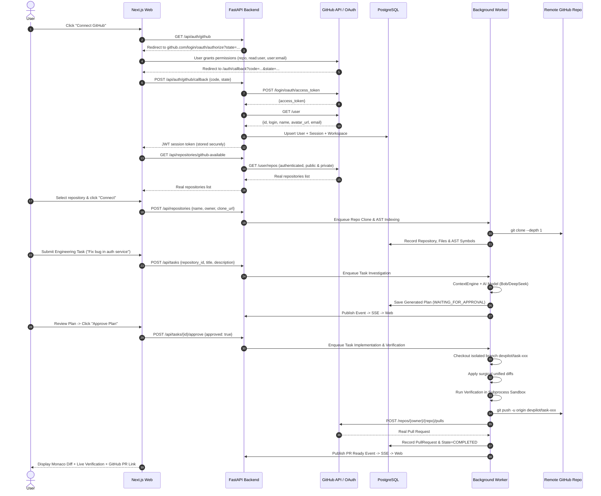

# Pasha DevPilot — Target Architecture (Production)

> Blueprint: Production-Ready Hackathon Architecture
> Platform: Railway Single-Project Multi-Service Topology

---

## 1. Production Topology

```
Railway Project: "pasha-devpilot"
│
├── web (Next.js 15 Frontend)
│   ├── Port: 3000
│   ├── Public Domain: https://web-production-xxxx.up.railway.app
│   └── Communicates with: api (internal & public)
│
├── api (FastAPI Backend)
│   ├── Port: 8000
│   ├── Public Domain: https://api-production-xxxx.up.railway.app
│   ├── Internal Domain: http://api.railway.internal:8000
│   ├── Communicates with: postgres, redis, github.com, ai providers
│   └── Healthcheck: GET /health
│
├── worker (Background Job Engine)
│   ├── Command: python -m apps.worker.worker
│   ├── Communicates with: redis (queue), postgres (state updates)
│   └── Processes: Repo analysis, agent execution, test verification, git push
│
├── postgres (Managed PostgreSQL 16)
│   ├── Internal URI: postgresql+asyncpg://${{PGUSER}}:${{PGPASSWORD}}@${{PGHOST}}:${{PGPORT}}/${{PGDATABASE}}
│   └── Stores: Users, Sessions, Workspaces, Repos, Tasks, Steps, Diffs, Runs, PRs, AuditLogs
│
└── redis (Managed Redis 7)
    ├── Internal URI: redis://default:${{REDIS_PASSWORD}}@${{REDIS_HOST}}:${{REDIS_PORT}}/0
    └── Handles: Background job queue (BLPOP/RPUSH), real-time pub/sub, SSE coordination
```

---

## 2. Real GitHub Integration Flow



---

## 3. Worker Architecture & Queue Model

- **Queue Name**: `devpilot:jobs`
- **Job Payload**:
  ```json
  {
    "job_id": "job_uuid",
    "job_type": "investigate_task" | "execute_task" | "index_repo" | "scan_repo",
    "payload": { ... },
    "created_at": "ISO-8601"
  }
  ```
- **Resilience**:
  - Worker runs with `brpop` on Redis list.
  - If Redis is unavailable or unconfigured (e.g. standalone test mode), the API falls back gracefully to in-process execution via `BackgroundTasks`.

---

## 4. Security & Sandbox Guardrails

1. **Secret Masking & Exclusion**:
   - `.env`, `*.pem`, `*.key`, `*.cert`, AWS credentials, and GCP service accounts are excluded from AI model context and git commits.
   - All outgoing logs and UI payload responses mask `sk-*`, `ghp_*`, and `gho_*` tokens.
2. **Execution Sandbox**:
   - Subprocess execution within repository directory.
   - Command allowlist + blocked patterns: `rm -rf`, `del`, `curl | bash`, `git push --force`.
   - Hard execution timeout (default: 60 seconds).
3. **Permission Tiers**:
   - **READ**: Automatic (indexing, search, AST parsing).
   - **WRITE**: Human approval required (plan approval gate).
   - **PUSH / PR**: Authenticated, verified tests, human-authorized.
